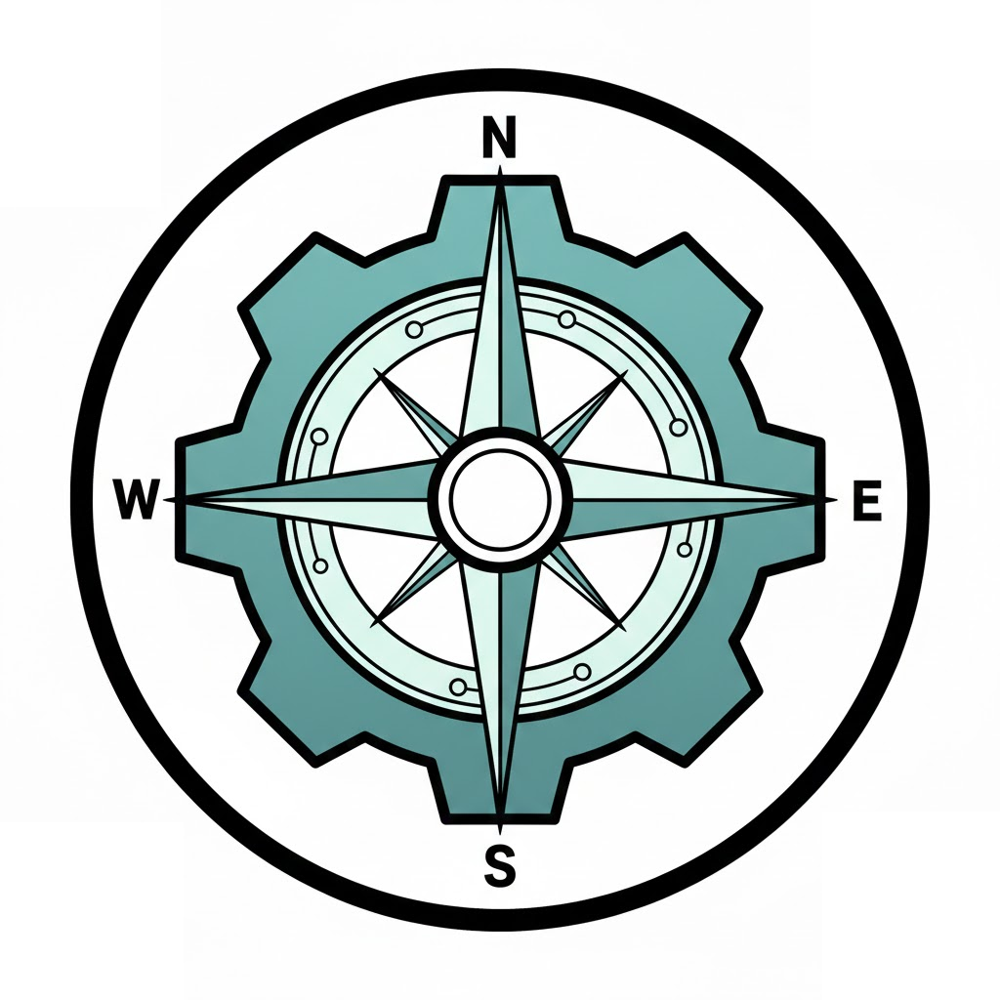
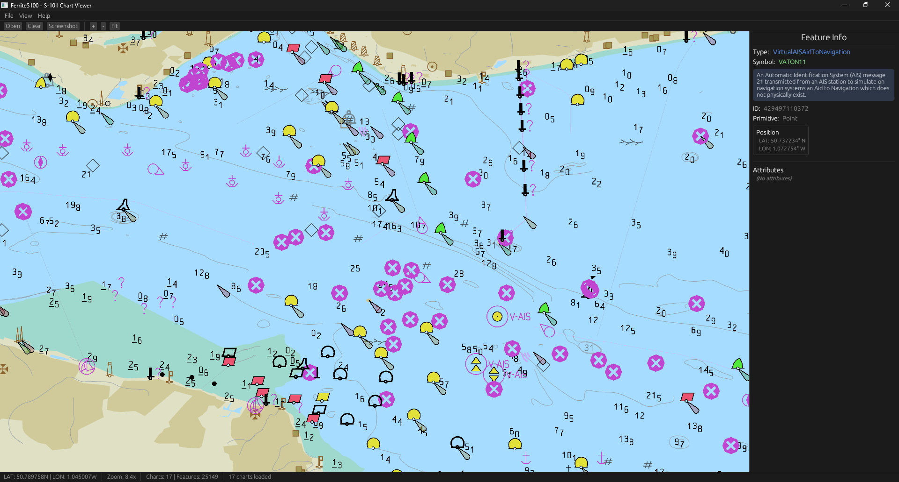

<p align="center">
  
</p>

<h1 align="center">FerriteS100</h1>

<p align="center">
  <strong>A high-performance S-100/S-101 Electronic Navigational Chart (ENC) viewer written in Rust</strong>
</p>

<p align="center">
  <a href="#features">Features</a> •
  <a href="#screenshots">Screenshots</a> •
  <a href="#installation">Installation</a> •
  <a href="#usage">Usage</a> •
  <a href="#security">Security</a> •
  <a href="#sbom-software-bill-of-materials">SBOM</a> •
  <a href="#license">License</a>
</p>

<p align="center">
  
  
  
  
  
</p>

---

## Overview

**FerriteS100** is a Rust application *trying* to parse and render IHO S-100/S-101 electronic navigational charts. Because apparently reading PDFs of maritime standards wasn't painful enough, we decided to implement them in Rust.

The project leverages modern GPU rendering via [wgpu](https://wgpu.rs/) and *attempts* to follow the S-100 portrayal model using Lua scripts. No ships were harmed in the making of this software (please don't actually navigate with this).

## Screenshots

<p align="center">
  
</p>

<p align="center"><em>S-101 Electronic Navigational Chart rendered with FerriteS100</em></p>

## Features

| Category | Description |
|----------|-------------|
| **Chart Parsing** | Full ISO 8211 binary format parsing for S-101 ENC files (`.000`) |
| **Dynamic Catalogues** | Runtime loading of Feature Catalogue (FC) and Portrayal Catalogue (PC) from XML |
| **Lua Portrayal** | Standard-compliant portrayal using official S-100 Lua scripts |
| **GPU Rendering** | Hardware-accelerated rendering with wgpu (Vulkan/DX12/Metal) |
| **Multi-cell Support** | Load and display multiple chart cells simultaneously |
| **Symbol Rendering** | SVG-based symbol rendering with color profile support |

### Interactive Features

- **Pan & Zoom** — Smooth navigation with mouse/trackpad
- **Feature Inspector** — Click any feature to view detailed attributes
- **Real-time Coordinates** — Live latitude/longitude display
- **Screenshot Export** — Save rendered charts as PNG

## Installation

### Prerequisites

- **Rust 1.70+** with Cargo
- GPU with **Vulkan**, **DirectX 12**, or **Metal** support

### Build from Source

```bash
# Clone the repository
git clone https://github.com/hoyeonchoKMOU/FerriteS100.git
cd FerriteS100

# Build (release mode recommended)
cargo build --release

# Run
cargo run --release
```

## Usage

### Quick Start

1. Place S-101 chart files (`.000`) in the `ChartData/` directory
2. Ensure catalogues are configured:
   - Feature Catalogue: `catalogues/FC/`
   - Portrayal Catalogue: `catalogues/PC/`
3. Run the application

### Controls

| Input | Action |
|-------|--------|
| **Scroll** | Zoom in/out |
| **Left Drag** | Pan the view |
| **Left Click** | Inspect feature |
| **Right Click** | Reset view |
| **File → Open** | Load additional charts |

## Project Structure

```
FerriteS100/
├── src/main.rs                    # Application entry point
├── crates/
│   ├── ferrite-iso8211/           # ISO 8211 binary format parser
│   ├── ferrite-s100-core/         # S-100 core data structures
│   ├── ferrite-feature-catalog/   # Feature Catalogue XML parser
│   ├── ferrite-portrayal-catalog/ # Portrayal Catalogue XML parser
│   ├── ferrite-lua/               # Lua portrayal engine (sandboxed)
│   ├── ferrite-render/            # Abstract rendering instructions
│   └── ferrite-wgpu/              # GPU renderer
├── catalogues/
│   ├── FC/                        # Feature Catalogue XML
│   └── PC/                        # Portrayal Catalogue (Lua, SVG, colors)
└── ChartData/                     # S-101 chart files (.000)
```

## Key Principles

1. **No Hardcoding** — Feature and Portrayal catalogues are loaded dynamically at runtime (because we learned the hard way)
2. **Standard Compliance** — Lua portrayal rules follow IHO international standards (or at least we're trying)
3. **S-100 Specification** — Implementation strictly follows IHO S-100/S-101 specifications (500+ pages of bedtime reading)

## Security

FerriteS100 implements a **sandboxed Lua environment** via [mlua](https://github.com/mlua-rs/mlua):

| Protection | Description |
|------------|-------------|
| **Safe Libraries Only** | Only loads base, string, table, math |
| **No Dangerous Libraries** | `os`, `io`, `debug` are **NOT** loaded |
| **No File Loading** | `loadfile` and `dofile` disabled |
| **No C Modules** | `package.loadlib` and C searchers disabled |
| **Restricted Search** | Only Portrayal Catalogue directory is searchable |

This design mitigates potential security risks from malicious Portrayal Catalogue scripts (**CWE-829**, **CWE-749**).

## SBOM (Software Bill of Materials)

FerriteS100 supports generating SBOM for supply chain security and compliance.

### Generate SBOM

```bash
# Install cargo-sbom (SPDX format)
cargo install cargo-sbom

# Generate SPDX SBOM
cargo sbom > sbom.spdx.json

# Alternative: CycloneDX format
cargo install cargo-cyclonedx
cargo cyclonedx --format json > sbom.cdx.json
```

### Dependency Audit

```bash
# Install cargo-audit
cargo install cargo-audit

# Scan for known vulnerabilities
cargo audit

# Generate audit report
cargo audit --json > audit-report.json
```

### Dependency Tracking

| File | Description |
|------|-------------|
| `Cargo.lock` | Exact dependency versions (committed to repo) |
| `Cargo.toml` | Direct dependency declarations |

All dependencies are sourced from [crates.io](https://crates.io) and audited via [RustSec Advisory Database](https://rustsec.org/).

## Dependencies

| Crate | Purpose |
|-------|---------|
| [wgpu](https://wgpu.rs/) | GPU rendering |
| [winit](https://github.com/rust-windowing/winit) | Window management |
| [egui](https://github.com/emilk/egui) | User interface |
| [mlua](https://github.com/mlua-rs/mlua) | Lua scripting (sandboxed) |
| [resvg](https://github.com/RazrFalcon/resvg) | SVG rendering |
| [quick-xml](https://github.com/tafia/quick-xml) | XML parsing |

## References

- [IHO S-100 Standard](https://iho.int/en/s-100-universal-hydrographic-data-model)
- [IHO S-101 Product Specification](https://iho.int/en/s-101-electronic-navigational-chart)

## License

This project is licensed under the **MIT License** — see the [LICENSE](LICENSE) file for details.

## Contributing

Contributions are welcome! Please feel free to submit issues and pull requests. If you actually understand the S-100 standard, we *really* need your help.

## Acknowledgments

- **IHO** (International Hydrographic Organization) for the S-100/S-101 standards
- **Korea Maritime and Ocean University (KMOU)** for research support

---

<p align="center">
  <sub>Developed by <a href="https://github.com/hoyeonchoKMOU">Hoyeon Cho</a> at KMOU</sub>
</p>
