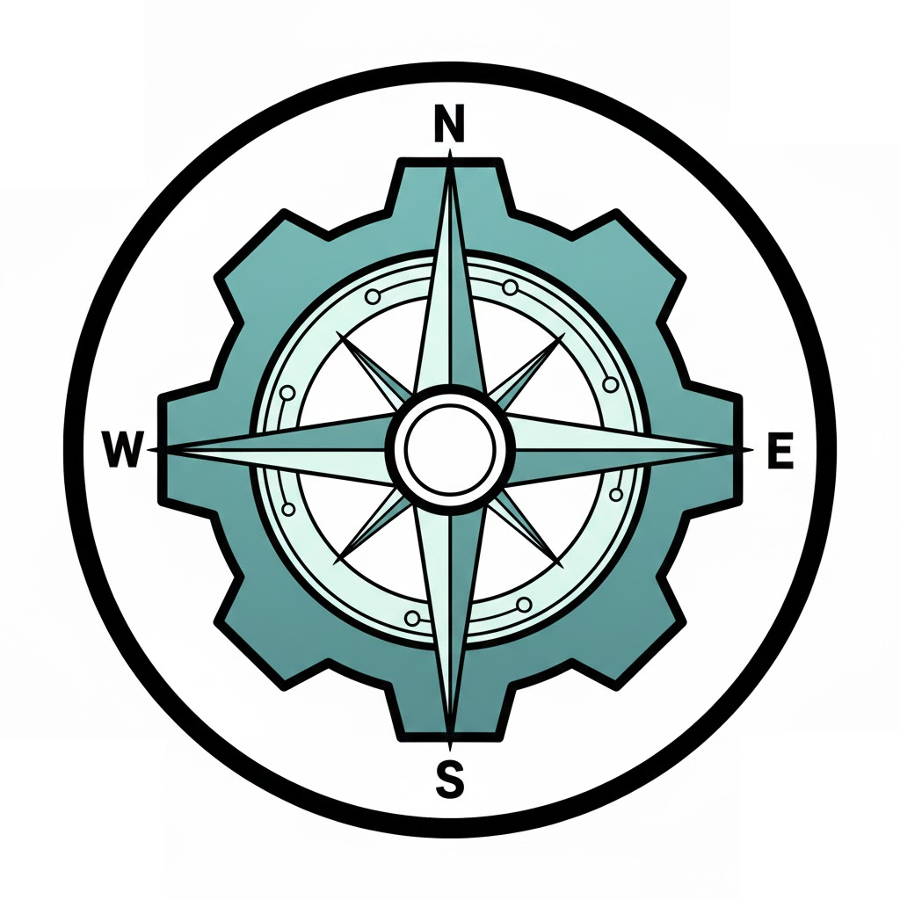
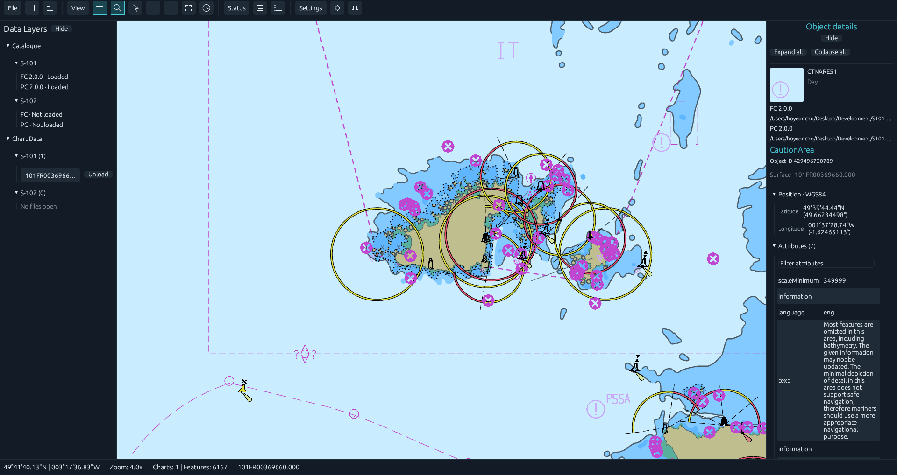

<p align="center">
  
</p>

<h1 align="center">FerriteS100</h1>

<p align="center">
  <strong>A high-performance S-100/S-101 Electronic Navigational Chart (ENC) viewer written in Rust</strong>
</p>

<p align="center">
  <a href="#features">Features</a> •
  <a href="#screenshots">Screenshots</a> •
  <a href="#installation">Installation</a> •
  <a href="#usage">Usage</a> •
  <a href="#security">Security</a> •
  <a href="#sbom-software-bill-of-materials">SBOM</a> •
  <a href="#license">License</a>
</p>

<p align="center">
  
  
  
  
  
</p>

---

## Overview

**FerriteS100** is a Rust application *trying* to parse and render IHO S-100/S-101 electronic navigational charts. Because apparently reading PDFs of maritime standards wasn't painful enough, we decided to implement them in Rust.

The project leverages modern GPU rendering via [wgpu](https://wgpu.rs/) and *attempts* to follow the S-100 portrayal model using Lua scripts. No ships were harmed in the making of this software (please don't actually navigate with this).

## Screenshots

<p align="center">
  
</p>

<p align="center"><em>S-101 Electronic Navigational Chart rendered with FerriteS100</em></p>

## Features

| Category | Description |
|----------|-------------|
| **Chart Parsing** | Full ISO 8211 binary format parsing for S-101 ENC files (`.000`) |
| **Memory-Mapped I/O** | Zero-copy file loading using OS page cache for faster chart loading |
| **Dynamic Catalogues** | Runtime loading of Feature Catalogue (FC) and Portrayal Catalogue (PC) from XML |
| **Lua Portrayal** | Standard-compliant portrayal using official S-100 Lua scripts |
| **GPU Rendering** | Hardware-accelerated rendering with wgpu (Vulkan/DX12/Metal) |
| **Multi-cell Support** | Load and display multiple chart cells simultaneously |
| **Symbol Rendering** | SVG-based symbol rendering with color profile support |
| **String Interning** | Game-style optimization reducing memory usage for symbol references |
| **Plugin System** | Extensible architecture with ABI-stable plugin support |

### Interactive Features

- **Pan & Zoom** — Smooth navigation with mouse/trackpad
- **Feature Inspector** — Click any feature to view detailed attributes
- **Real-time Coordinates** — Live latitude/longitude display
- **Screenshot Export** — Save rendered charts as PNG

### Plugin System

FerriteS100 supports plugins for extended functionality. Each plugin:
- Loads independently as a dynamic library (DLL)
- Has its own FC/PC catalogue loading (e.g., S-421 for route planning)
- Uses ABI-stable interface via [abi_stable](https://docs.rs/abi_stable)
- Runs in a sandboxed environment with limited host API access

**Included Plugin: S-421 Route Planner**

| Feature | Description |
|---------|-------------|
| **Waypoint Management** | Click to add, right-click to remove waypoints |
| **Distance Calculation** | Haversine formula for accurate nautical miles |
| **S-421 Export/Import** | Standard-compliant GML route exchange format |
| **Customizable Display** | Line color, width, distance units, waypoint symbols |

## Installation

### Prerequisites

- **Rust 1.70+** with Cargo
- GPU with **Vulkan**, **DirectX 12**, or **Metal** support

### Build from Source

```bash
# Clone the repository
git clone https://github.com/hoyeonchoKMOU/FerriteS100.git
cd FerriteS100

# Build (release mode recommended)
cargo build --release

# Run
cargo run --release
```

### Build with Plugins (Windows PowerShell)

```powershell
# Build main app and all plugins
.\scripts\build.ps1

# Build main app only (skip plugins)
.\scripts\build.ps1 -SkipPlugins

# Create release package
.\scripts\release.ps1

# Create KMOU edition (includes Catalogues and ChartData)
.\scripts\release.ps1 -KMOU
```

## Usage

### Quick Start

1. Place S-101 chart files (`.000`) in the `ChartData/` directory
2. Ensure catalogues are configured:
   - Feature Catalogue: `Catalogues/FC/S-101/`
   - Portrayal Catalogue: `Catalogues/PC/S-101/`
3. Run the application

### S-101 Test Data

S-101 sample charts can be downloaded from the **UKHO Data Hub**:

- [UKHO S-101 Test Data](https://datahub.admiralty.co.uk/portal/home/item.html?id=6966cb7ce9454ccf9afbbd3c9a105f9e)

> **Note**: UKHO provides official S-101 test datasets for development and testing purposes. Registration may be required.

### macOS local test setup

The local UKHO download is stored in `TestData/UKHO-S101/`. `ChartData/UKHO` points to its
S-101 exchange sets. Directory loading searches nested folders for `.000` base cells.

- Double-click `Start-Portsmouth.command` for Portsmouth Harbour and approaches.
- Double-click `Start-Solent.command` for all 17 UKHO base cells.
- Repeat the parser and Lua check with `cargo run --example validate_charts -- ChartData/UKHO`.

The downloaded public **Complete S10X dataset** uses S-101 1.0 exchange catalogues;
it is an older trial release, distinct from the current form-based UKHO distribution.
The bundled application catalogues are S-101 2.0.0. Some legacy objects produce
portrayal warnings and use fallback symbols. Test results are in `TestResults/`.
The optional Windows route plugin is not installed on this macOS setup.

### Controls

| Input | Action |
|-------|--------|
| **Scroll** | Zoom in/out |
| **Left Drag** | Pan the view |
| **Left Click** | Inspect feature |
| **Right Click** | Reset view |
| **File → Open** | Load additional charts |

#### Route Plugin Controls (when active)

| Input | Action |
|-------|--------|
| **Left Click** | Add waypoint at position |
| **Right Click** | Remove last waypoint |
| **Export** | Save route as S-421 GML file |
| **Import** | Load route from S-421 GML file |

## Project Structure

```
FerriteS100/
├── src/
│   ├── main.rs                    # Application entry point
│   └── plugins.rs                 # Plugin system integration
├── crates/
│   ├── ferrite-iso8211/           # ISO 8211 binary format parser
│   ├── ferrite-s100-core/         # S-100 core data structures
│   ├── ferrite-feature-catalog/   # Feature Catalogue XML parser
│   ├── ferrite-portrayal-catalog/ # Portrayal Catalogue XML parser
│   ├── ferrite-lua/               # Lua portrayal engine (sandboxed)
│   ├── ferrite-render/            # Abstract rendering instructions
│   ├── ferrite-wgpu/              # GPU renderer
│   ├── ferrite-plugin-api/        # Plugin API (ABI-stable traits)
│   └── ferrite-plugin-loader/     # Plugin DLL loader & verifier
├── plugins/
│   └── route-plugin/              # S-421 Route Planner plugin
├── Catalogues/
│   ├── FC/
│   │   ├── S-101/                 # S-101 Feature Catalogue
│   │   └── S-421/                 # S-421 Feature Catalogue (for plugins)
│   └── PC/
│       ├── S-101/                 # S-101 Portrayal Catalogue
│       └── S-421/                 # S-421 Portrayal Catalogue (for plugins)
├── ChartData/                     # S-101 chart files (.000)
└── scripts/
    ├── build.ps1                  # Build main app & plugins
    ├── release.ps1                # Create release package
    └── upload.ps1                 # Upload to GitHub releases
```

## Key Principles

1. **No Hardcoding** — Feature and Portrayal catalogues are loaded dynamically at runtime (because we learned the hard way)
2. **Standard Compliance** — Lua portrayal rules follow IHO international standards (or at least we're trying)
3. **S-100 Specification** — Implementation *inspired by* IHO S-100/S-101 specifications (we read most of the 500+ pages, probably)

## Security

FerriteS100 implements a **sandboxed Lua environment** via [mlua](https://github.com/mlua-rs/mlua):

| Protection | Description |
|------------|-------------|
| **Safe Libraries Only** | Only loads base, string, table, math |
| **No Dangerous Libraries** | `os`, `io`, `debug` are **NOT** loaded |
| **No File Loading** | `loadfile` and `dofile` disabled |
| **No C Modules** | `package.loadlib` and C searchers disabled |
| **Restricted Search** | Only Portrayal Catalogue directory is searchable |

This design mitigates potential security risks from malicious Portrayal Catalogue scripts (**CWE-829**, **CWE-749**).

### Plugin Security

Plugins are loaded as dynamic libraries with security verification:

| Protection | Description |
|------------|-------------|
| **Ed25519 Signatures** | DLLs are verified against signed manifests (production mode) |
| **SHA-256 Hash** | DLL integrity verified before loading |
| **Sandboxed Host API** | Plugins can only call whitelisted host functions |
| **ABI Stable Interface** | [abi_stable](https://docs.rs/abi_stable) ensures safe FFI |
| **Version Compatibility** | API version checked before plugin initialization |

## SBOM (Software Bill of Materials)

FerriteS100 supports generating SBOM for supply chain security and compliance.

### Generate SBOM

```bash
# Install cargo-sbom (SPDX format)
cargo install cargo-sbom

# Generate SPDX SBOM
cargo sbom > sbom.spdx.json

# Alternative: CycloneDX format
cargo install cargo-cyclonedx
cargo cyclonedx --format json > sbom.cdx.json
```

### Dependency Audit

```bash
# Install cargo-audit
cargo install cargo-audit

# Scan for known vulnerabilities
cargo audit

# Generate audit report
cargo audit --json > audit-report.json
```

### Dependency Tracking

| File | Description |
|------|-------------|
| `Cargo.lock` | Exact dependency versions (committed to repo) |
| `Cargo.toml` | Direct dependency declarations |

All dependencies are sourced from [crates.io](https://crates.io) and audited via [RustSec Advisory Database](https://rustsec.org/).

## Dependencies

### Graphics & GUI

| Crate | Version | Purpose |
|-------|---------|---------|
| [wgpu](https://wgpu.rs/) | 24 | GPU rendering (Vulkan/DX12/Metal) |
| [winit](https://github.com/rust-windowing/winit) | 0.30 | Cross-platform window management |
| [egui](https://github.com/emilk/egui) | 0.31 | Immediate mode GUI |
| [resvg](https://github.com/RazrFalcon/resvg) | 0.45 | SVG symbol rendering |
| [image](https://github.com/image-rs/image) | 0.25 | Image processing (PNG export) |

### Parsing & Data

| Crate | Version | Purpose |
|-------|---------|---------|
| [nom](https://github.com/rust-bakery/nom) | 8 | ISO 8211 binary parsing |
| [quick-xml](https://github.com/tafia/quick-xml) | 0.37 | FC/PC XML catalogue parsing |
| [serde](https://serde.rs/) | 1 | Serialization framework |
| [encoding_rs](https://github.com/hsivonen/encoding_rs) | 0.8 | Character encoding (ISO-8859-1) |
| [memmap2](https://github.com/RazrFalcon/memmap2-rs) | 0.9 | Memory-mapped file I/O for zero-copy chart loading |

### Scripting & Runtime

| Crate | Version | Purpose |
|-------|---------|---------|
| [mlua](https://github.com/mlua-rs/mlua) | 0.10 | Sandboxed Lua 5.4 portrayal engine |
| [rayon](https://github.com/rayon-rs/rayon) | 1.10 | Parallel chart loading & processing |

### Plugin System

| Crate | Version | Purpose |
|-------|---------|---------|
| [abi_stable](https://docs.rs/abi_stable) | 0.11 | ABI-stable trait objects for plugins |
| [libloading](https://github.com/nagisa/rust_libloading) | 0.8 | Dynamic library loading |
| [ed25519-dalek](https://github.com/dalek-cryptography/ed25519-dalek) | 2 | Plugin signature verification |
| [sha2](https://github.com/RustCrypto/hashes) | 0.10 | DLL hash verification |

### Utilities

| Crate | Version | Purpose |
|-------|---------|---------|
| [tracing](https://github.com/tokio-rs/tracing) | 0.1 | Structured logging |
| [anyhow](https://github.com/dtolnay/anyhow) | 1 | Error handling |
| [thiserror](https://github.com/dtolnay/thiserror) | 2 | Error derive macros |
| [earcutr](https://github.com/frewsxcv/earcutr) | 0.4 | Polygon triangulation (earcut) |

## References

- [IHO S-100 / S-101 Standards](https://registry.iho.int/)

## License

This project is licensed under the **PolyForm Noncommercial License 1.0.0**.

| Usage | Allowed |
|-------|---------|
| Research / Academic | Yes |
| Personal / Non-profit | Yes |
| Modification | Yes (with attribution) |
| Commercial / Enterprise | **No** |

**Key points:**
- Free for research, education, and non-commercial use
- Modifications allowed with proper attribution
- **Not** a copyleft license (your modifications don't have to use the same license)
- Commercial use requires separate licensing agreement

See the [LICENSE](LICENSE) file for full terms.

## Contributing

This is a personal project and is not accepting contributions at this time. Feel free to fork it if you'd like to experiment on your own!

## Acknowledgments

- **IHO** (International Hydrographic Organization) for the S-100/S-101 standards
- **Korea Maritime and Ocean University (KMOU)** for research support

---

<p align="center">
  <sub>Developed by <a href="https://github.com/hoyeonchoKMOU">Hoyeon Cho</a> at KMOU</sub>
</p>

### S-102 bathymetry (local implementation)

`--s102 <file-or-directory>` opens S-102 3.0.0 HDF5 bathymetry. Directories are searched recursively for `.h5` files. `--s102-pc <directory>` selects its independent portrayal catalogue; the default is `Catalogues/PC/S-102`. S-101 and S-102 may be loaded together. On this checkout, `Start-S102.command` opens the downloaded SHOM Saint-Malo exchange set.

The adapter reads regular grids in bounded windows, preserves missing depth and uncertainty, and evaluates the official bathymetry Lua rule and colour profile. Map clicks query the nearest grid cell and show depth, uncertainty and vertical reference metadata. Colour profile and contour changes also recolour bathymetry. The geographic renderer currently accepts EPSG:4326 and grids within the GPU texture size limit. Other CRS, larger tiled grids and the complete S-98 interoperability policy remain to be implemented. Quality coverage reading and inspection are implemented as described below; the official quality portrayal rule is NullInstruction. The local implementation is not an ECDIS certification or a navigation system.

Selecting rendered S-101 point symbols, lines or filled areas shows the source chart, primitive type and actual feature attributes. Polygon holes are excluded from interior picks, and a screen-space tolerance allows edge selection. An overlapping-object list lets the user change the selected feature; identity includes source cell and feature ID. Selected paths and polygon boundaries are outlined in cyan, with a marker at the pick location. Geometry picking primitives live in the product-neutral kernel, while rendering projection and application UI remain separate. Native mouse/menu interaction remains unverified because the Mac is locked; runtime geometry/source audits and math tests passed.

`ISODGR01` is the official isolated underwater danger symbol. `Shallow Water Dangers` controls additional shallow-water danger portrayal; mandatory isolated dangers in otherwise safe water remain governed by the official PC rule.

Lua feature enumeration and collected results are now ordered deterministically, preventing hash-map/table traversal from changing equal-priority decluttering winners. Instruction cache version 6 invalidates previous entries after identity/ordering changes. `FERRITE_NO_CACHE=1` bypasses instruction cache reads and writes for reproducibility checks. Two independent SHOM cold runs and a cached run produced identical chart RGB pixels and selection audit JSON. `--selection-audit <output.json>` alongside `--screenshot` checks actual renderer-approved point/line/area probes against their source cell, feature type and attributes; it does not emulate native mouse/menu input.

### S-100 authentication

`ferrite-security` verifies the S-100 Part 15 ECDSA P-384/SHA-384 signatures of `CATALOG.XML` and its referenced resources, using independently installed X.509 trust anchors. It verifies issuer paths, certificate validity and key usage before using the signature public key, rejects escaping paths and unlisted datasets, and creates private authenticated snapshots for product readers. Signed resources are authenticated before parsing; a failed signature blocks the load. The official IHO 5.2 root and its source/fingerprint are in `Trust/`.

The application retains evaluation mode for unsigned public trial datasets and reports those as unauthenticated. `--require-signatures` rejects unsigned datasets. The kernel batch API requires the caller to choose `UnsignedPolicy::Reject` or `UnsignedPolicy::Evaluation` explicitly. Older SE5.1 signature encoding and inconsistent metadata from public test packages are reported separately; their exact delivered bytes must still authenticate against the installed root. This is authentication support, not a completed licensing/encryption scheme or SECOM service. Permit processing, licensed decryption, revocation updates and SECOM transport remain separate work.

For an independent report: `cargo run --example verify_exchange -- <S100_ROOT> Trust/IHO-S100-5.2.pem`.

## SECOM receive layer (in progress)

`ferrite-secom` provides a product-independent blocking HTTPS/mTLS read client
for the GLA-RAD SECOMLib v1 interoperability profile (reference commit
`825e47ca4e7f68b0ac68fd8f96994f0e3d2f94d2`). Transport CA and PKCS12 client
identity are configured separately from `PayloadTrust`, which authenticates
payload certificates and detached ECDSA signatures. All objects in a returned
page must pass authentication. Run this client outside the UI thread.

The client supports ping, capability, paged summary and UUID object GET.
Responses are bounded, redirects and implicit proxies are disabled, and TLS
hostname verification remains enabled. Rustls provides the same TLS backend on
macOS and Windows; the PKCS12 identity is decoded in memory with OpenSSL and
passed as its certificate chain and private key. Only the configured transport
CA is trusted. Payloads use Base64 data/certificate DER
and hexadecimal signature DER. Supported profiles are P-256/P-384 with SHA-2
or SHA-3; independently installed payload roots are required. These roots do
not implicitly become IHO S-100 Part 15 trust anchors.

Local mutual TLS tests prove certificate delivery, authenticated byte recovery,
and rejection of redirected, oversized and tampered responses. This is not a
claim of IEC 63173-2 conformance or live service interoperability. Compression,
encryption, acknowledgements, subscriptions, uploads, revocation checking and
application installation/loading of received exchange sets remain unfinished.
Compressed/encrypted payloads currently fail explicitly. The public reference
is based on the IEC ED1 final draft dated 2022-03-11.

## Part 15 verification performance

The resource verifier hashes each file once for its report and all direct P-384
signatures. Chained signatures are verified in dependency order using an ID
index and a parent-to-children graph. With B input bytes and S signatures, file
hashing is O(B), graph traversal is expected O(S), and file buffering stays at
64 KiB. Signature/graph state remains O(S), with one cached key per distinct
certificate. Certificate trust and signature verification are preserved;
noncanonical or trailing signature DER is explicitly rejected.

A local M5 release experiment (three samples per condition) reduced a 64 MiB
single-signature verification from 0.072318 s to 0.037898 s, and a synthetic
16-direct/512-chained-signature case from 0.787449 s to 0.189542 s. These are
verification-only times, not typical application load benchmarks. The 13 public
exchange sets / 28 signed resource instances retain identical authenticated
hashes and signature metadata. See `TestResults/SECURITY_OPTIMIZATION_REPORT.txt`.

### Visibility and animation regression audit

`--animation-audit <output.json>` with `--screenshot <output.png>` compares stationary,
animation, and stationary render rebuilds at the same viewport. It checks the displayed
geometry indices, symbol identities and positions, and render statistics including text
label counts. This is a renderer audit, not an automated native mouse or Windows test.

Coincident complete-curve suppression respects current scale and viewing groups, handles
reversed point order, and uses a content-based cache. Partial segment overlap, spatial
masking and cross-feature portrayal dependencies still require further implementation.

### End-user S-101 object information

The FC parser retains public/protected/private binding visibility. The S-101 adapter
filters private bindings, their descendants, and the mandatory S-101 4.3.6.3 internal
attributes from the end-user Pick Report. Original source attributes and portrayal
inputs remain intact. `validate_pick_reports` audits FC visibility and actual base
cells independently of the window. PAIX refers to the ATTR tuple position, while
ATIX may repeat across codes; malformed parent paths are omitted.

### Object identity and attribute parent scope

End-user information displays FOID as its agency/number/subdivision component tuple,
separately from cell record ID. Binary FOID parsing preserves delimiter-valued bytes.
When multiple ATTR fields are combined, field-local PAIX is normalized to the internal
parent tuple position; ATIX remains the occurrence under a code and parent. Malformed
fields are staged and rejected before insertion. Build the actual application with
`cargo build --release --workspace --bins --examples`; `--examples` alone does not
refresh the main executable.

### Spatial masking and line boundaries

S-100 MASK tuples are decoded with their full seven-byte stride and MUIN retained.
The S-101 adapter resolves line geometry from curves, nested composites, surface
outer/inner boundaries and explicit spatial references. Component masks and spatial
association scale ranges apply to both normal and Unsuppressed line instructions.
Lua exposes the real surface ring associations, including resolvable internal virtual
composites for multi-curve rings. `validate_spatial_masks` audits base-cell geometry.
This restores previously omitted boundaries and increases full rebuild work; complete complex line styling still requires implementation.

### Partial line visibility

The common render planner subtracts higher-priority coincident segment intervals,
including overlaps with different vertex sampling. Drawing and picking share the
remaining source-segment parameter spans. Nearby parallel lines and simple crossings
are preserved. Content-based cache reuse includes vertex order; spatial indexes are
temporary, and cache hits do not allocate the eligible-line vector.
`line_visibility_smoke` exercises this path on the actual GPU at three zoom levels;
`benchmark_line_suppression` compares an independent synthetic interval oracle.
GPU zoom preserves physical pixel stroke thickness; complete complex line styling
remains unfinished.

GPU zoom stroke correction: stroke vertices now carry a geographic center and unscaled screen-pixel offset. Native GPU fixtures at 0.5/1/2 zoom retain 4/4/4 pixel widths; SHOM and Portsmouth loading/selection audits pass. See `TestResults/FIXED_STROKE_REPORT.txt`. Complete complex-line portrayal remains pending.

S-100 pen units: S-101 line instructions now use explicit millimetres, converted at the display boundary using 96 logical DPI and OS scale factor. Legacy pixel instructions remain pixels; cache schema is 11. Native GPU width and SHOM/Portsmouth audits pass (81 tests); physical monitor calibration remains pending. See `TestResults/STROKE_UNITS_REPORT.txt`.

Temporal state: Lua TimeValid now consumes Date/Time/DateTime bounds, accumulates intervals until ClearTime and preserves them on all generated render primitives (cache schema 11). 86 tests and SHOM/UKHO/IHO declaration audits pass. Selector evaluation and temporal render/hit filtering are implemented as described below; see `TestResults/TEMPORAL_STATE_REPORT.txt`.

Calendar visibility: Date intervals now drive rendering, suppression, sounding selection and the displayed geometry list used for hit testing. `--viewing-date YYYY-MM-DD` supports reproducible date selection; 93 tests, GPU date-switch fixtures and SHOM/UKHO/IHO audits pass. XML reduced-date compatibility covers UKHO legacy months. Mixed temporal state, mixed recurrence cycles and date UI remain pending; see `TestResults/DATE_VISIBILITY_REPORT.txt`.

Clock selectors: Time and DateTime now support complete ISO basic/XML forms, explicit UTC offsets, midnight-spanning daily windows and exact fractional boundaries. Use `--viewing-instant 2026-10-04T09:30:00+09:00` and separate `--local-time-offset +09:00` for unzoned source bounds (default UTC). 99 tests, GPU hit fixtures, SHOM selection and signed S-102 pixel regression pass. Mixed temporal state, leap seconds and named timezone/DST policies remain pending; viewing-time controls are implemented below. See `TestResults/CLOCK_VISIBILITY_REPORT.txt`.

Live clock refresh: the app waits until the next temporal boundary and rebuilds only when indexed temporal visibility changes. A 60-second guard detects wall-clock changes, including backwards jumps after finite intervals expire. Expired selection/candidates are cleared, and geometry highlights use the displayed line fragments. 103 tests and native idle GPU transitions pass; actual mouse/menu interaction remains unverified while macOS is locked. See `TestResults/LIVE_TEMPORAL_REPORT.txt`.

Triangulation cache lifetime: render contexts expose a unique geometry revision. Both precomputation and drawing discard stale geometry when instruction ownership changes, while viewport, color and time updates reuse unchanged geometry. Allocation keys use a tuple rather than XOR. 104 tests, 64 native GPU images (256 pixel probes and 31 observed address reuses), SHOM and Portsmouth regressions pass. See `TestResults/CACHE_LIFETIME_REPORT.txt`.

Viewing-time controls: the toolbar Time button opens live clock, fixed date, fixed instant or all-dates selection. A separate source-local offset applies to unzoned data. Invalid drafts cannot change active settings; CLI selectors initialize the UI. Time changes share displayed-selection cleanup with clock expiry. 109 tests and native GPU dialog/mode/export fixtures pass; actual OS mouse/menu interaction remains pending. See `TestResults/TEMPORAL_UI_REPORT.txt`.

Image export now uses the screen's common text and selection overlay; `save_screenshot_with_ui` additionally includes application panels. Full view rebuilds reset previous GPU pan/zoom and rebase the zoom reference to avoid applying a transform twice. Screen and export now use the common GPU geometry pass described below; text ordering within portrayal priorities still requires further work.

Common chart pass: screen and image export share geometry buffer preparation and the same plane/priority-ordered GPU pass, including world coastlines, chart masks, raster placement and longitude copies. Each priority completes across all longitude copies before the next priority, so wrapped lower-priority geometry cannot cover higher-priority geometry. 109 tests, native GPU ordering/wrapping/mask fixtures, SHOM/Portsmouth selection, signed S-102 loading, fixed-stroke and live-time regressions pass. Export images remain identical before and after actual surface renders; direct surface-pixel parity and OS interaction were not verified. See `TestResults/CHART_PASS_REPORT.txt`.

S-102 survey quality: the adapter reads the feature-oriented quality ID grid and 15 survey attribute fields, preserves fill ID 0 and sparse record identifiers, and joins quality metadata to the map depth inspection path. Capability flags are described as survey capabilities, and unknown codes remain explicit. Invalid source UTF-8 is displayed with an encoding warning and preserved original bytes. Long inspection text is selectable inside a bounded scroll area; encoding warnings remain visible above it. 113 workspace tests, all 7,000,000 SHOM quality IDs, 14 authenticated application inspection probes and native GPU layout/pixel regression checks pass. OS input and Windows interaction remain unverified; complete semantic validation and larger-grid tiling remain pending. See `TestResults/S102_QUALITY_REPORT.txt`.

S-102 quality semantic checks: the shared instance count must be 1, contradictory seafloor/bathymetry coverage flags are rejected, and survey dates are checked as complete or truncated 8-character HDF5 dates using a reusable common-kernel validator. 117 tests, all SHOM quality IDs and the authenticated app inspection/pixel regression pass. Further field ranges and semantic relationships remain pending. See `TestResults/S102_QUALITY_SEMANTICS_REPORT.txt`.

Located coverage queries: common-kernel `CoverageQuery` returns the sample together with its source node coordinates and row/column. S-102 inspection shows query and source positions explicitly and states that no spatial interpolation is performed. Missing values remain missing; the legacy sample API delegates to the same 1x1 query. 118 tests, 28 authenticated application probes (14 off-centre), unchanged chart pixels and GPU information-panel layout pass. Actual OS input remains unverified. See `TestResults/LOCATED_COVERAGE_REPORT.txt`.

Longitude text wrapping: chart text now uses the same 0/-360/+360 copies and pan/zoom transform as GPU geometry. Point/AABB/pattern-ring culling also considers those enabled copies. One font layout is shared by copies; font size and local offset stay fixed during GPU zoom. 119 tests, 13 native GPU glyph probes, 9 export pairs across actual surface renders, stable isolated glyph bounding boxes at three zoom levels, SHOM/Portsmouth selection and authenticated S-102 regression pass. Cross-copy collision removal, text interleaving within portrayal priorities and Windows/input validation remain pending. See `TestResults/TEXT_WRAP_REPORT.txt`.

Longitude-copy selection: point and precise line/area picking now query the enabled longitude copies while retaining source coordinates, cell/feature identity and FOID. The selected copy shift is kept separately and applied to the selection anchor and highlighted geometry. 120 tests, SHOM/Portsmouth original probes plus 108 added longitude-copy queries, 9 GPU highlight probes/export pairs across actual surface rendering, and authenticated S-102 regression pass. OS mouse/list interaction and Windows validation remain pending. See `TestResults/WRAPPED_SELECTION_REPORT.txt`.

Wrapped coverage inspection: the common coverage API queries the same enabled geographic longitude copies while preserving the source grid node and displayed copy shift separately. EPSG:4326 is required for wrapping; projected CRS coordinates are never shifted as degrees. S-102 depth and quality inspection share the source node. 121 tests, 84 authenticated application queries (28 per copy), unchanged original inspection transcripts/chart pixels and GPU panel layout pass. OS input/Windows validation, larger-grid tiling and other CRS rendering remain pending. See `TestResults/WRAPPED_COVERAGE_REPORT.txt`.

S-102 raster tiling: source windows are generated lazily and converted/uploaded one at a time, with a default edge of min(2048, GPU texture limit). `FERRITE_RASTER_TILE_EDGE` can force smaller diagnostic tiles. GPU batches commit only after production succeeds, preserving old layers on errors. 122 tests, 7 million independent source-node colour checks, 112 CPU/GPU tiles, four axis fixtures, batch rollback and 84 authenticated inspection probes pass. Default rendering matches prior pixels; forced 256 tiling reproducibly differs at 74 pixels, so its GPU boundary/sampling regression remains unresolved. Total GPU residency is still O(N), including old/new layers during replacement. See `TestResults/RASTER_TILING_REPORT.txt`.

Coverage sample interpolation: a dedicated raster pipeline now evaluates nearest texture coordinates per MSAA sample; symbol textures keep their existing pipeline. The official WGSL interpolation rules describe the centre/sample distinction. 122 tests, unchanged 84 application inspections, GPU transaction/common chart pass and unchanged Portsmouth pixels pass. Forced-tile/full-grid differences decrease from 74 to 41 pixels, which remains an unresolved parity failure. The full-grid image changes at 11,319 pixels because sample-based antialiasing differs from centre sampling; no pixel-equivalence or speed claim is made. See `TestResults/RASTER_SAMPLING_REPORT.txt`.

Shared raster source lattice: every tile now derives cell ownership from the same full-grid screen origin/step and pixel centre, then performs an integer textureLoad. Internal edge padding plus ownership discard removes tile-local UV interpolation differences. Actual SHOM tile/full images and 12 axis/zoom/pan GPU fixtures have zero differing pixels; independent source-node probes also pass. The original centre-sampled baseline differs at 24 boundary pixels. This supersedes the unresolved 74/41-pixel observations above. 122 tests, authenticated inspection, Portsmouth, transaction and common chart-pass regressions pass. Overall GPU residency, larger-than-device source proof and Windows/OS input remain pending. See `TestResults/RASTER_LATTICE_REPORT.txt`.

Larger-than-device coverage proof: four chunked/compressed synthetic S-102 HDF5 files use 8193 columns against the tested device limit of 8192. 5/17-tile uploads agree at all pixels across 12 axis/zoom/pan GPU cases, with 13,528 independent inverse-geographic colour/NoData probes. A one-column edge tile initially exposed 267 outer-edge differences; clamping padded vertices to the common source footprint resolves them. Actual application loading, signed SHOM, Portsmouth, 12 small-grid fixtures and four GPU transaction failure cases pass. Source metadata is validated before allocation and global indices remain unsigned. Very large f32 lattices, GPU residency and Windows/input remain pending. See `TestResults/LARGE_RASTER_GRID_REPORT.txt`.

Chart glyph ordering and deconfliction: text now participates in the shared plane/priority GPU pass after same-priority area/line/point geometry, using the shared egui font atlas and physical glyph sizes. Actual rotated glyph bounds feed a product-neutral R-tree/SAT placement planner across all longitude copies. Higher plane/priority labels retain collisions; stable input order breaks ties. 125 tests, 7 ordering probes, wrapped/colliding copy GPU fixtures and stable 161×75 rotated glyph bounds pass. Signed S-102 and Portsmouth selection regressions pass; Portsmouth pixels intentionally change. SHOM selected identities match but candidate counts differ at 34 probes and require investigation. Complete text semantics, buffer/index optimisation and Windows/input remain pending. See `TestResults/ORDERED_TEXT_REPORT.txt`.

### 지도 영역 동기화 후속 검증 (2026-10-04)

실제 패널 경계와 UI/OS 배율로 지도 영역·조회 좌표를 동기화한다. GPU UI12조건 및 SHOM cold/warm36조회가 일치했다. 과거34개 후보 수 차이는 수정 전 직렬 재실행에서도 재현되지 않아 원인을 단정하지 않는다. 자세한 내용: `TestResults/CHART_LAYOUT_REPORT.txt`.

### 다중 제품 표시 표준 대조 (2026-10-04)

공식 S-98 2.0.0 최종 배포본을 `Standards/S98-2.0.0`에 저장했다. 현재 S-101/S-102 동시 로딩은 지원하지만 고정 raster 우선순위가 IC 처리와 Level0 overlay를 대체하지 않는다. Level1/2, 제품 상태/조회 정렬의 누락과 구현 경계는 `TestResults/MULTIPRODUCT_STANDARDS_AUDIT.txt`에 기록했다.

### 일반 제품 overlay (2026-10-04)

S-102 고정 우선순위4를 제거하고 PC의 UnderRadar/3과 공통 overlay composition stage를 보존한다. 화면은 interoperability off임을 표시한다. 실제 GPU12색상조회, strict SHOM 두 제품 로딩과84수심조회가 통과했다. IC 기반 Level1/2 및 제품 통합 pick은 추가 구현이 필요하다. `TestResults/MULTIPRODUCT_OVERLAY_REPORT.txt` 참조.

### 항행선·등화 경계선 표시 수정 (2026-10-04)

LineStyle 정의를 실제 draw와 분리하고 inline 점선 전달을 복구했다. LocalCRS 등화 경계25mm는 확대율에 독립적으로 표시·조회한다. SHOM4셀17337객체 strict 로딩과27개 조회, GPU3배율 검사, 새 캐시/재로딩 화면0픽셀 차이를 확인했다. 전체 검사130통과. `TestResults/LIGHT_SECTOR_LINES_REPORT.txt` 참조.

### AugmentedPath geometry 상태 및 원호 (2026-10-04)

표준대로 pending 선분을 active path로 모아 재사용하고 SpatialReference를 ClearGeometry까지 유지한다. 공통 PortrayalPath가 Local mm 원호와 세 점 원호를 계산하며 zoom 중에도 크기와 조회 위치를 유지한다. 공식 SHOM PC390개 원호 layer 복구,138검사 통과, native GPU3배율 및 캐시 재로딩 화면0픽셀 차이를 확인했다. 전체 augmented drawing/CRS 지원은 계속 구현이 필요하다. `TestResults/AUGMENTED_PATH_REPORT.txt` 참조.

### AugmentedPath 복합 선분 (2026-10-04)

연결된 선분의 점선 위상을 유지하고 disjoint run/Annulus 내외 경계를 분리하여 가짜 연결선을 막는다. 표시·조회·선택 강조에 공통 경로 iterator를 사용하며 일반 world 선은 원본 점 배열을 빌린다.140검사, GPU33위치, strict SHOM27조회 및 캐시 반복 화면0픽셀 차이를 확인했다. `TestResults/GROUPED_PATH_REPORT.txt` 참조.

### S-100 반복 점선 정의 (2026-10-04)

여러Dash/start를 common DashCycle로 보존하고 PC XML의 점선을 표시·조회에 전달한다. PC dash_array API는 dash_cycle로 교체했다. suppression 교차는 canonical 목록을 선형으로 비교한다.146검사, GPU42위치, strict SHOM27조회 및 cache16 재로딩을 확인했다. synthetic 성능 비교 범위와 남은복합 LineStyle 구현은 `TestResults/DASH_CYCLE_REPORT.txt` 참조.

### S-100 여러 선 스타일과 투명도 (2026-10-04)

LineInstruction의 모든 스타일 참조와 명령 transparency를 보존한다. 투명/폭0 선은 표시·조회·억제에서 제외하고 palette 변경 때 alpha를 유지한다.150검사, GPU9픽셀·3배율, strict SHOM27조회 및 cache17 반복 화면0픽셀 차이를 확인했다. 남은복합스타일 범위는 `TestResults/STROKE_LAYER_REPORT.txt` 참조.

### 확대·축소 입력 안정성 (2026-10-04)

스크롤 입력을 log-space 배율로 계산하고 PixelDelta를 window DPI로 logical 환산한다. 휠/버튼/CLI 범위를 통일했다.153검사, 공식PC심볼의5입력 GPU 이미지 동일, SHOM27조회 및 직전화면0픽셀 차이. 실제Windows/OS입력과 최초view변화 원인 검증 한계는 `TestResults/NAVIGATION_REPORT.txt` 참조.

### 면·글자 투명도와 글자 배경 (2026-10-04)

명령opacity와palette alpha를 분리 보존하며 글자의 회전 배경을 같은 표시순서로 그린다. 글자 premultiplied 색상 합성 오류도 수정했다.157검사, adapter/GPU18조건, ordered-text 회귀, strict SHOM27조회 및 cache18 반복 비교. WindowsSSH 인증 성공 후 실기 빌드 진행 중이며, 적합성/검증 한계는 `TestResults/COLOR_OPACITY_REPORT.txt` 참조.

Windows native validation (2026-10-04): full workspace tests 157 passed/1 ignored;
macOS 158 passed/1 ignored. RTX3090 desktop session 1 completed 11 native checks,
including signed SHOM S101/S102 loading, rendering, picking and an expected
invalid-input rejection. See `TestResults/WINDOWS_VALIDATION_REPORT.txt`. Directory
discovery ignores AppleDouble metadata; automated capture errors exit without
a modal Windows dialog. Full IC/PDC conformance and manual OS input remain open.

Signed IC rendering-plane foundation: `CompositionPlane` preserves nonzero signed
S-100 Part 16 orders; raster, vector, symbol and text share this key. Plane-aware
line suppression and cache invalidation follow actual drawing order. Native
Mac/Windows 505-plane fixtures pass. IC XML loading, selectors, version metadata
and Level 2/PDC are not yet connected; application products remain in Level 0.
See `TestResults/INTEROP_PLANE_REPORT.txt`.

### IC display-plane XML reader (partial)

`ferrite-interoperability` now reads the Part 16 display-plane XML subset with product/code-list identity, spatial selectors, exact decimal scalar filters, bounded parsing, and conflict detection. The native 505-plane fixture resolves two rules from a locally authored XML; it does not certify real product feature adapters or full S-98 processing. Unsupported operators, combined filters, PDC, suppression, symbol replacement, and higher levels are rejected.

The actual application remains Level 0 until catalogue trust, compatible product editions, feature adapters and controls are connected. The unmodified official IC XSD fails compilation against its ISO imports at `dataProduct` (complex restriction of a simple-content base); full XSD validation is therefore not claimed. See `TestResults/IC_READER_REPORT.txt` and `ic-schema-validation.json` for evidence.

### IC product adapters and selection ordering (partial)

S-101 composition planning now reads FC-typed attribute paths, preserves unknown values and exact Integer/Real encodings, distinguishes source-feature from portrayal primitives, and applies plans atomically. S-102 can resolve a whole-coverage assignment including its viewing group. The actual viewer now ranks feature picks by the GPU display plane and drawing priority before geometry preference.

The locally authored IC fixture was applied to authenticated SHOM data on Mac and Windows: 17,337 S-101 objects / 69,570 instructions, 27 selected instructions, and 7 S-102 coverages. Symbolization, geometry, colour, visibility and source identity were preserved. This does not activate IC processing in the viewer or certify full S-98; catalogue trust, compatible editions, PDC and controls remain. See `TestResults/IC_ADAPTERS_REPORT.txt`.

### Viewer chrome and dataset menus (partial)

The viewer has palette-aware application colours, vector toolbar icons, keyboard focus, reduced UI motion and a scrolling object-details panel. File menus distinguish S-101/S-102 datasets from exchange-set folders; the Feature Catalogue picker selects XML files. Night switching updates the background from the active portrayal catalogue.

Mac native pointer/menu/keyboard tests loaded the signed SHOM four-cell set and selected a Wreck. Final Mac/Windows workspace tests and native rendering passed, with five changed source hashes matching. These UI checks do not certify complete S-100/S-101 or S-98 interoperability. See `TestResults/UI_CHROME_REPORT.txt`.

### Current integration validation (macOS, 2D)

The qualified 322-file viewer source retains only the 2D S-101/S-102 chart view;
the globe/sphere camera, UI mode, CLI path and rendering modules are removed. General
WGS84 geodesy and Mercator navigation remain. Historical globe reports in
`TestResults/` describe the older implementation.

The line suppression cache now prepares stable geometric relations before
interactive traversal, within its existing 64 MiB transformed-input and 32 MiB
compiler admission limits. Current visibility, date, viewing-group, scale and
coverage decisions remain live. Refused preparation uses the existing lazy
planner; `FERRITE_LINE_SUPPRESSION_PREWARM=0` explicitly disables preparation.
The DEF escape decoder also uses one pass while preserving the original
nonrecursive escape order and Unicode output.

In one hidden SHOM workload, paired diagnostics removed four growth-triggered
relation recompilations: affected frame preparation fell from about 16–36 ms
to 6–12 ms. Preparation cost 136–219 ms initially and retained about 2.38 MB
of compiled relations in that workload. Warm results were mixed; this is not
foreground 60 FPS or cross-platform certification. The combined candidate
passed 272 CPU tests, eight original signed-chain comparisons and 14 paired
palette/pattern/zoom recovery checks including the official Wreck at 200x.

Lua 5.4 remains the shipping qualification backend; Lua 5.4/5.5 are selected at
build time. Feature/Portrayal Catalogue versions remain independently selectable.
The corrected shallow-pattern contract suppresses only the recognized official PC's
optional shallow selector. Other mandatory pattern fills remain enabled. Source
cell/feature attributes, display order, coverage masks remain part of
the exact comparison gates; mandatory ENC objects are not clustered or omitted.

The V9 2D candidate passed 484 CPU tests and 14 paired checks (28 hidden native
cases) with exact comparison of the tested geometry, pixels and semantic exports.
Actual symbol instancing reduced one measured packed payload from 40,680 to
13,584 bytes. The extra immutable instance cache saw 11 hits in 4,262 requests;
these figures do not establish a frame-rate improvement. V10 subsequently passed 488 CPU tests and eight same-executable, separate-process
OFF/ON 500-frame diagnostic runs. Their final restored-frame images and semantic
exports matched; the additional 14-pose/28-execution hidden parity gate
also passed. V12 passed its all-targets check, 51 S-101 tests, 73 application
tests and native executable build. Its two 500-frame hidden eventloop controls
completed with exact final RGBA, instructions and all exported raw geometry buffers. Debug, Release and Release-fast builds also
passed six hidden loading cases over two complete SHOM base/update chains, with
exact image, drawing-instruction and raw-buffer parity. All three executable
profiles use the default coverage cache.

The current integration moves owned `CellData` into each fresh Lua host instead
of cloning all feature, attribute, geometry and association maps a second time.
The borrowed public API remains available. Five ownership/isolation tests and
actual 5,059-feature full/selected/context/source-change comparisons passed. An
eight-run same-binary paired experiment measured 211.32 vs 208.90 ms median
inclusive conversion and Lua processing; the small 1.14% change is not a robust
FPS improvement claim.

The security module retains opaque original resource authentication, canonical
signature values, signer certificate DER, catalogue bytes and discovery byte
ranges. `verify_exchange_catalogue` authenticates bounded catalogue bytes only;
physical exchange verification continues to require every resource. Catalogue
proofs do not establish missing-file ownership, complete product metadata,
producer cancellation authority or revocation status. Thirty security tests and
two real signed S-101 update-chain tests passed. Eight hidden OFF/ON loading
controls matched the preceding installed version exactly. Full S-102 fileless
cancellation admission and SECOM-to-viewer publication remain unfinished. Debug, Release
and Release-fast also passed six hidden loading controls over both SHOM chains,
with exact image, instruction and raw-buffer parity.

V12 enables the exact immutable coverage source-binding cache by default.
`FERRITE_FLAT_COVERAGE_BINDING_CACHE=0` explicitly selects the uncached control
path. The cache reuses source-to-command binding metadata, while current camera,
scale, settings and coverage decisions are evaluated afresh. It does not cache
permission to hide chart objects or reuse stale screen masks. The V10 controlled
comparison reduced mean CPU coverage preparation from 4.953 to 2.960 ms (40.24%).
This is a measured stage reduction in Release-fast, not a demonstrated 60 FPS
improvement. Symbol instancing and the additional instance cache remain opt-in.

The V9 controlled 500-pose diagnostic kept first-use traversal and wide outside
panning separate from 300 warm chart-relative samples. Warm serialized service
p95 was 20.168 ms and p99 21.678 ms; 62 of 300 samples exceeded 16.7 ms. The
measured mean 4.2 ms coverage stage is CPU `prepare_flat_coverage`, not GPU
execution. A separate timer measures host-side coverage binding, plan,
pipeline and upload preparation. Serialized GPU completion waits and hidden
redraw cadence do not prove foreground presentation rate or smooth 60 FPS.

In the V12 cache-enabled eventloop control, the 300 warm submitted-redraw
intervals had p95 9.267 ms and p99 9.760 ms; none exceeded 16.7 ms. The first
399 inside-chart intervals included four above 16.7 ms, with a maximum of
35.45 ms. These are hidden synthetic-gesture eventloop intervals, not completed
GPU frames or foreground display FPS. Only two configurations were measured;
this is not an ABBA statistical gain qualification.

Tests use `FERRITE_BACKGROUND_TEST=1`, the macOS prohibited activation policy and
actual hidden/unfocused-window assertions. Eventloop diagnostics issue one
compound gesture camera change per redraw and do not wait for the GPU per frame;
GPU completion and physical display cadence remain distinct measurements. Real
OS gestures, hardware DPI changes and a sustained foreground 60 FPS guarantee
are not established. The Windows test PC is offline; current Windows validation
has not been performed.

Public test datasets remain in `TestData/`; historical `TestResults/`, local
catalogues, `Trust/`, chart paths and `Start*.command` launchers are preserved.
Private keys, captures, datasets and compiled executables remain excluded from
Git. Source/build provenance and backend selection are documented in
`BUILDING.md`. Complete S-100/S-101/S-98 conformance, SECOM-to-viewer integration
and untested input/product cases are not certified by these scoped results.

Palette/settings publication now reuses static line relations after an exact,
bounded comparison of the two sorted instruction streams. Directed coordinate
bits, source ordinals/provenance, priority, display plane, suppression and deferred
geometry must match. The relation epoch is independent of the geometry ownership
revision: borrowed triangulation pointers, coverage bindings and picking keep
their original lifetime rules. Current colour/stroke visibility, date, scale,
groups, dependencies and coverage eligibility are still evaluated afresh.
`FERRITE_STATIC_LINE_RELATION_REUSE=0` disables inheritance; the default and `1`
enable it. A declined comparison follows the existing preparation path. Existing
64MiB transformed-input, 32MiB relation and 16MiB visibility-plan limits remain.
The comparison keeps no source geometry copy and runs only at publication.

The candidate passed 297 CPU tests and the all-targets check. Six paired hidden
palette-change poses, including a centred official Wreck symbol at 200x, matched
full chart pixels, ordered instructions, raw GPU buffers and symbol attributes.
Failed staging retained the old frame; successful publication retained the relation
epoch while issuing a fresh geometry ownership revision. In the preceding static-line-only benchmark, independent sixteen-run
same-binary OFF/ON ABBA/BAAB measurements over the signed SHOM 5,059-feature chain
reduced warm palette-change commit medians from about 323ms to 169ms (47.5–47.6%).
Preparation in that preceding benchmark stayed near 230ms; preparation plus commit medians fell by about
27.6–27.7%. These timings exclude subsequent render/present and describe the
retry path after rejected staging, not startup, continuous navigation or displayed
FPS. Separate signed loading/profile checks cover Debug, Release and Release-fast.
The transaction-local Lua stroke cache remains uninstalled because its timing
results were mixed.

### Exact Area triangulation reuse qualification (macOS, 2D)

The qualified source enables bounded exact Area topology reuse by default.
`FERRITE_AREA_TRIANGULATION_REUSE=0` opts out; `1` enables it explicitly. An
unset variable enables reuse, while other values, including non-Unicode values,
disable it. The policy is selected at process startup and shared by renderer
retention and publication admission. Source ownership revisions remain fresh.
Inheritance requires exact directed exterior/hole coordinate bits, hole order,
sorted source ordinals/provenance, priority and display plane; projection must
match at rebind. Palette and view-dependent visibility, date, scale, groups,
Parent dependencies, coverage and picking follow their existing evaluation paths.
Rejected triangulations remain rejected; declined admission uses original cold
geometry. No approximate geometry, quality reduction or omitted ENC objects are
introduced.

Retention is bounded to 4,096 records and 32 MiB of logical retained capacity.
This is not a limit on the existing active triangulation cache, allocator overhead
or process RSS. The measured large-chain retained payload was 24,596,184 bytes.

CPU contracts, the all-targets check and fresh Lua 5.4 builds passed. The opt-in
qualification passed 12 hidden native controls against protected original
shipping over two official signed SHOM update chains. Full chart RGBA, ordered
instructions, all eight exported raw GPU buffers, geometry/source metadata and
symbols matched. Full selected attributes and indexed/original picking matched
at 1x. The 200x centred official Wreck camera covered rendering and rollback;
it did not provide a pick-query comparison because the protected original had
no visible line probes. The shipping default policy subsequently passed 16
controls comparing protected original, explicit OFF, default ON and explicit ON.
Debug, Release and Release-fast then passed 12 default-ON loading/palette-recovery
controls, with exact images, instructions, raw buffers and symbols against the
Release-fast control. Shipping profile checks do not add full-attribute-value
or hardware-DPI coverage beyond the earlier qualification. Failed publication
retained the previous frame in the tested recovery paths. All native windows
were hidden and unfocused.

A separate 16-run same-binary OFF/ON ABBA/BAAB experiment on the signed
5,059-feature chain measured successful palette-retry commit medians of
450.390 to 14.863 ms for Dusk (96.70% reduction) and 497.268 to 17.419 ms for
Night (96.50%). All ON commits were below all OFF commits in both palettes
and both order directions. The measured commit includes exact epoch comparison
and retained-payload recapture. These are different measurements from the
preceding static-line-only benchmark. Preparation was mixed: its medians fell
from 623.179 to 571.234 ms in Dusk but rose from 545.070 to 675.701 ms in Night;
the cause is not established. Same-row preparation plus commit medians fell
by 44.56% and 33.11%, respectively. Initial loading, subsequent render/present,
continuous navigation and physical display cadence were not measured by this
commit experiment. It establishes a scoped palette-publication CPU improvement,
not foreground 60 FPS or current Windows qualification; the Windows PC remains
offline.

The source and three executable profiles are qualified. Installing these
artifacts is a separate guarded step performed by the integration owner; this
qualification does not itself assert that the Desktop installation was updated.
The installer preserves historical TestResults, TestData, Trust, local catalogues,
unchanged launchers and other unmanaged assets.


### Exact Mercator source northing reuse (macOS, 2D)

The renderer enables exact camera-independent Mercator source northing
reuse when `FERRITE_FLAT_SOURCE_NORTHING_CACHE` is unset. Set it to `0` to opt out
and use the original conversion path, or `1` to enable it explicitly. Other values,
including non-Unicode values, disable reuse. The policy is read when an immutable
source binding is created; changing the environment does not retroactively change
an existing binding. Camera affine transforms, wrap handling, physical-mm/DPI
conversion, scale/visibility rights, source identity, coverage and picking remain
on their existing paths. The opaque prepared value validates projection, original
latitude bits and fixed WGS84 parameters before reuse; ineligible or over-budget
bindings use the original conversion without dropping objects.

Admission is limited to 16,384 source slots and 1 MiB of charged record payload per
binding, checked before allocation. This excludes allocator/Arc overhead, active
binding generations, the existing source-binding cache and process RSS; it is not
a global memory limit. The large signed-chain measurement charged 644,288 bytes
(10,067 slots), and the small chain 9,280 bytes (145 slots). Measured token-building
wall time was 0.170–0.192 ms and 0.00275–0.00300 ms, respectively. That cold timer
starts after locking and covers token construction only, not complete initial
loading, lock wait or first-frame cost.

Prior opt-in production qualification passed 60 hidden native launches, including
24 actual production launches, over two signed SHOM chains, Dusk/Night and
1x/20x/200x cameras. Separate OFF/ON tests compared 20 captured poses per run,
including seam-crossing poses: full chart pixels, ordered instructions, all eight
raw GPU buffers, source/symbol metadata, selected attributes, original/indexed
picks and CPU prepared coverage masks/decisions matched. These are sampled
correctness controls, not a proof of every animation frame or actual hardware-DPI
changes. Windows is offline and was not requalified.

The separate same-binary timing experiment retained all 32 runs and 16,000 rows,
with ABBA and BAAB orders, first-use, warm and outside-pan samples kept separate.
On the large chain, median warm per-run mean preparation fell from 5.0069 to
4.4238 ms in Dusk (11.65%) and 5.0005 to 4.4313 ms in Night (11.38%). The derived
main CPU coverage component fell from 1.8435 to 1.1861 ms and 1.8366 to 1.1778 ms
(35.66–35.87%); the combined coverage stage also includes a separately measured
host binding/plan/upload span, which is not GPU execution time. All eight large-chain
paired preparation comparisons improved. Small-chain preparation results were
mixed and do not establish a robust benefit. Mean total hidden handler time stayed
near 8.3 ms and did not materially improve; handler p95 increased about 1.6–1.8%.
All outliers were retained. Surface acquisition/FIFO pacing can absorb CPU savings.
Hidden cadence is not physical display FPS, completed GPU duration or a foreground
60 FPS guarantee.

The shipping default-policy CPU tests, all-targets check and fresh Debug,
Release and Release-fast builds passed. The separate 48-launch default/unset/
explicit-ON/OFF/original control gate and 12 three-profile native comparisons
passed. A fresh publication's first cache request constructs the token table;
zero hits at that point is valid, while warm reuse was verified separately in the
navigation experiment. Installation uses guarded profile receipts and an atomic
rollback journal. Installed copies are compared with their qualified archives,
preserving TestData, Trust, catalogues, launchers, historical TestResults and
unmanaged assets.


The App now builds owned Lua host `CellData` directly from each loaded cell.
The public `PortrayalContext` and borrowed APIs remain available; every cell
still receives a fresh VM and executes the complete official rules. The change
removes unused Rust feature metadata, two extra code strings per feature and
a temporary Arc/RwLock on this owning path. It does not remove Lua feature items
or cache portrayal results.

The complete 5,059-feature SHOM base/update chain matched the independent
original extraction path across all CellData fields and ordered typed outputs.
The qualified candidate passed 136 CPU tests, the all-targets check and 24 hidden
signed native controls over two chains at Dusk/Night and 1/20/200x, including
selection and failed-publication recovery. An eight-block extraction-only
comparison measured 2.718 versus 2.518 ms median of block medians, a 7.36%
reduction in that stage. Original unused metadata capacity totalled 904,952
bytes; this is owned payload capacity, not an RSS or allocator-overhead measure.
The inclusive conversion-plus-Lua experiment showed roughly 0.5% median change
with a paired regression, so it does not establish a robust whole-load or FPS
improvement. Current foreground 60 FPS and Windows validation remain unproven.
